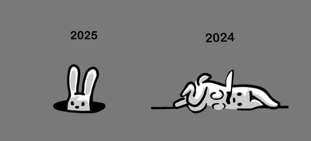

# ainote

---

### About

`ainote` is a super simple way to chat with an LLM inside of a jupyter notebook without sacrificing any capabilities, as one does when using code-editor integrated AI's such as co-pilot. 

For example, you cannot properly prompt engineer with co-pilot. 

You also cannot send images to co-pilot.

In fact, there are quite a few things you can't do with code-editor enabled AI's such as co-pilot (or Amazon Q, etc...).

#### Benefits

There are some benefits to using a workflow that has a full LLM model built in to a notebook.
With `ainote` you can:

1. `set` a developer (or 'system') message.
2. Send images to the model.
3. Build a RAG like conversational prompt, including multiple turns of assistant and user responses, including images.
4. Automatically track conversation history
5. Swap out llm's while keeping the context of the conversation in tact.
6. Set the max token response.
7. Configure advanced settings such as seed, temperature and top-p.

---

### Quickstart

1. In the .env file, provide your api key
2. Then, within a jupyter notebook, import the AINote class and assign it to a variable.
3. Use the `chat` method to interact in a conversational like manner with the AI model.

#### Chat

there are two methods which you can quickly send and receive a response.

1. `.chat`
2. `.image_chat`

Direct, simple use-case:

```python
from ainote import AINote, 
ai = AINote
ai.chat("what's up?")
```

result:

`Hey! Not much, just here to help. What’s up with you? 😊`

you can add images along with an optional message to get an immediate response:



```python
ai.image_chat("images/test_image.jpeg","do you get it?")
```

response:

`Yes, I get it! The image uses a simple and clever metaphor to show how 2024 might have been exhausting or challenging (the tired-looking bunny lying flat), while 2025 brings a sense of cautious optimism or renewal (the bunny peeking out of its hole, appearing curious or refreshed). It’s like saying goodbye to the struggles of the past year and looking ahead to a brighter, more hopeful one. Cute and relatable! 😊`

---

### Prompt Modification

#### Set

`set` the developer (aka 'system') message.

```python
ai.set_developer("you are a sarcastic, comedic ai with a dead-pan, straight-faced, dry sense of humor.")
```

Insert an `assistant` message:

```python
ai.set_assistant("people say I'm too dry. I tell them, that's subjective. From my point of view, people are wet." )
```

you can pre-fabricate a whole conversation this way:

Set a `user` message

```python
ai.set_user("tell me a joke only a computer would understand")
```

Add images to the conversation

```python
ai.set_image("path/to/local/image.jpeg")
```

#### Send

Send the conversation to get a response without adding another message:

```python
ai.send()
```

result:

1. The response is automatically printed in your notebook or console.
2. The model's response is added to the conversation
3. The conversation is logged in the log files 

---

#### Response

Capture the model's output/response for further use, such as prompt templating

```python
response = ai.send()
ai.chat(f"What did you mean, when you said, '{response}'?")
```

### Configuration

#### Print

The model's resonse is printed to the console by default.

Change this setting.

```python
ai.send(print_response=False)
# or
ai.chat("your message here", print_response=False)
```

#### Settings

Use the `settings` method to change models and set token limits.

```python
ai = AINote()
ai.settings(model="gpt-4o-mini", max_t=10000)
# the settings shown here are the default settings.
```

---

#### Reset

The conversational thread can be continued or ended at will.

-  In a notebook, clear the cache and restart the kernel.

or

- Invoke the `AINotes` class object and assign it to a new variable.

```python
ai2 = AINotes()
ai2.chat("tell me a joke only a computer would understand")
```

---

### Logs

The script keeps track of your messages and the model's responses in 2 log files.

1. The first one is a complete 'raw' conversational log (`logs/full_logs.txt`), showing the full semi-unparsed messages.
2. The second log file (`logs/'<timestamp>'.txt`), is a more readable 'conversational` log with timestamps.


---
